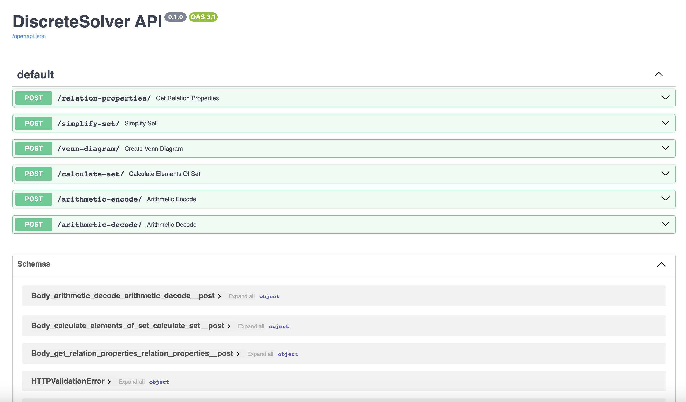

# DiscreteSolver

## Used technology stack:

<div align="center">


</div>

<p></p>

<div align="center">

</div>

## Here you can check the current result:
<a href="http://194.146.242.41/docs">Click here to check our results</a>


## Development team:
- <b>k6zma</b> <i>(@k6zma)</i> - Algorithms, API, DevOps, ML, TG Bot
- <b>std46d6b</b> <i>(@m4lvx)</i> - Design, Frontend
- <b>taisssam</b> <i>(@taisssam)</i> - Algorithms, Android app, IOS app
- <b>kir1l9x</b> <i>(@killmefasterdear)</i> - Algorithms, Dekstop app

## Current stage of development:
- <b>Set theory:</b>
    - Simplifying Set Expressions <u>(k6zma)</u>
    - Constructing Euler-Venn diagrams <u>(k6zma)</u>
    - Calculating Set Elements <u>(k6zma)</u>

- <b>Bulean Algebra:</b>
    - Bulding Carno cards <u>(taissam)</u>
    - Bulding CDNF and CKNF <u>(taissam)</u>
    - Finding minterms and maxterms <u>(taissam)</u>
    - Construction of reduced, minimal, and dead-end DNFs <u>(taissam)</u>
    - Construction of a truth table <u>(k6zma)</u>
    - Simplifying Bulean Expressions <u>(k6zma)</u>

- <b>Binary relationships:</b>
    - Calculating properties of a binary relation <u>(k6zma)</u>
    - Generating graph of a binary relation <u>(k6zma)</u>

- <b>Coding:</b>
    - Arithmetic encoding/decoding <u>(k6zma)</u>
    - Huffman encoding/decoding <u>(kir1l9x)</u>

## Example of working:
### Screenshot from API documentation:
<div align="center">

</div>

### Analysis of each method
- <b>/relation-properties/</b>:

    Submitting data in JSON format:
    ```json
    {
        "set_of_elements": "string",
        "binary_relation": "string"
    } 
    ```
    - In the set_of_elements line we write the set on which your binary relation is specified (If this set is unknown, then just leave empty quotes).
    - In the line “binary_relation” we write the binary relation.

    #### Examples to check:

    ```json
    {
        "set_of_elements": "1,2,3,4,5,6,7,8,9",
        "binary_relation": "(1,1),(2,2),(3,3),(4,4),(5,5),(6,6),(7,7),(8,8),(9,9),(1,2),(1,3),(1,4),(1,5),(1,6),(1,7),(1,8),(1,9),(2,4),(2,6),(2,8),(3,6),(3,9),(4,8)"
    }
    ```

    ```json
    {
        "set_of_elements": "1,2,3,4,5,6,7,8,9",
        "binary_relation": "(1,7),(7,1),(2,6),(6,2),(3,5),(5,3),(4,4)"
    }
    ```

    ```json
    {
        "set_of_elements": "Алекскей,Иван,Петр,Александр,Павел,Андрей",
        "binary_relation": "(Алекскей,Алекскей),(Алекскей,Александр),(Алекскей,Андрей),(Александр,Александр),(Александр,Алекскей),(Александр,Андрей),(Андрей,Андрей),(Андрей,Алекскей),(Андрей,Александр),(Петр,Петр),(Петр,Павел),(Павел,Павел),(Павел,Петр),(Иван,Иван)"
    }
    ```

    ```json
    {
        "set_of_elements": "1,2,3",
        "binary_relation": "(1,1),(2,2),(3,3),(3,2),(1,2),(2,1)"
    }
    ```
    